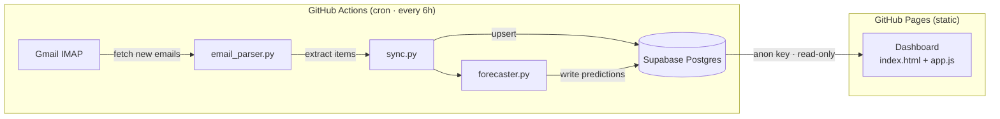

# Quick-Commerce Restock Predictor — Implementation Plan

Build an autonomous agent that reads Blinkit order-confirmation emails, tracks per-item consumption, and predicts restocking dates — surfaced on a lightweight GitHub Pages dashboard, at zero infrastructure cost.

---

## Architecture Overview



**Data flow**: Gmail → Python parser → Supabase writes (service key) → Dashboard reads (anon key)

---

## User Review Required

> [!IMPORTANT]
> **Gmail App Password** — You'll need to enable 2-Step Verification on your Google account and generate an App Password (Settings → Security → App Passwords). This is used by the Python script via IMAP; no OAuth flow needed.

> [!IMPORTANT]
> **Supabase Keys** — Two keys are used:
> - `SUPABASE_SERVICE_ROLE_KEY` → stored in GitHub Secrets, used by backend Python script for writes
> - `SUPABASE_ANON_KEY` → embedded in the dashboard JS (safe — RLS enforces read-only)

> [!WARNING]
> **Blinkit email format** — Blinkit order confirmation emails vary slightly over time. The parser will use regex + HTML parsing (BeautifulSoup) to extract item names, quantities, and prices. If the format changes, only `parsers/blinkit.py` needs updating. I'll build the parser to be resilient to minor HTML changes.

---

## Open Questions

> [!IMPORTANT]
> **Email search window** — On first run, how far back should the script look for Blinkit emails? Options:
> - Last 90 days (recommended for good initial predictions)
> - Last 30 days
> - All time
>
> The cron runs will use a high-water-mark (last processed email date from `orders` table) so only new emails are fetched on subsequent runs.

> [!NOTE]
> **Item normalization** — Blinkit item names can be verbose (e.g., "Amul Taaza Toned Fresh Milk 500 ml"). Should the dashboard show:
> - Full item names as-is from the email (simpler, no ambiguity)
> - A normalized/short name you can manually edit via Supabase (more work, cleaner UI)
>
> I'll go with full names by default plus add a `display_name` column you can optionally override.

---

## Proposed Changes

### Component 1 — Supabase Schema

#### [NEW] [schema.sql](file:///d:/tapck/supabase/schema.sql)

SQL migration file defining all four tables with RLS policies:

```sql
-- items: canonical item catalog
--   id (uuid PK), name (text unique), display_name (text nullable),
--   category (text nullable), unit (text), created_at

-- orders: one row per email/order
--   id (uuid PK), platform (text default 'blinkit'), order_date (timestamptz),
--   email_subject (text), email_message_id (text unique), total_amount (numeric),
--   created_at

-- order_items: line items joining orders ↔ items
--   id (uuid PK), order_id (uuid FK→orders), item_id (uuid FK→items),
--   quantity (integer), unit_price (numeric), created_at

-- predictions: latest forecast per item
--   id (uuid PK), item_id (uuid FK→items), avg_interval_days (numeric),
--   ema_interval_days (numeric), last_ordered (timestamptz),
--   predicted_restock_date (date), confidence (text), updated_at
```

RLS policies:
- All tables: `SELECT` for `anon` role (dashboard reads)
- All tables: `ALL` for `service_role` (backend writes)
- No `INSERT`/`UPDATE`/`DELETE` for `anon`

#### [NEW] [setup_guide.md](file:///d:/tapck/docs/setup_guide.md)

Step-by-step Supabase project creation, running the schema SQL, obtaining keys, and configuring GitHub Secrets.

---

### Component 2 — Email Parser (Python)

#### [NEW] [parsers/__init__.py](file:///d:/tapck/backend/parsers/__init__.py)
#### [NEW] [parsers/blinkit.py](file:///d:/tapck/backend/parsers/blinkit.py)

Blinkit email parser:
- Connects to Gmail via `imaplib` (stdlib) with App Password
- Searches for emails from Blinkit sender addresses (`noreply@blinkit.com`, etc.)
- Parses HTML body using `BeautifulSoup` to extract:
  - Order date
  - Item name, quantity, unit price
  - Order total
- Returns structured `list[OrderData]` dataclass
- Handles duplicates by checking `email_message_id` uniqueness

#### [NEW] [parsers/base.py](file:///d:/tapck/backend/parsers/base.py)

Abstract base class `EmailParser` — makes it trivial to add Zepto/Swiggy/BigBasket parsers later.

---

### Component 3 — Sync & Forecaster (Python)

#### [NEW] [sync.py](file:///d:/tapck/backend/sync.py)

Orchestrator script (entry point for GitHub Actions):
1. Fetch new emails via parser
2. Upsert items into `items` table (match on name)
3. Insert orders + order_items
4. Call forecaster
5. Upsert predictions

Uses `supabase-py` client with `SUPABASE_SERVICE_ROLE_KEY`.

#### [NEW] [forecaster.py](file:///d:/tapck/backend/forecaster.py)

Consumption forecasting:
- For each item, query `order_items` ordered by `order_date`
- Calculate **inter-purchase intervals** (days between consecutive orders of the same item)
- **Simple Moving Average (SMA)**: average of last N intervals (N=3 or all if fewer)
- **Exponential Moving Average (EMA)**: α = 0.3 weighting recent intervals more
- **Predicted restock date** = `last_ordered + ema_interval_days`
- **Confidence**: `high` (≥5 data points), `medium` (3-4), `low` (1-2)

Formula:
```
SMA = (1/N) × Σ intervals[i]   for i in last N purchases
EMA_t = α × interval_t + (1-α) × EMA_{t-1},  α = 0.3
restock_date = last_order_date + round(EMA)
```

#### [NEW] [requirements.txt](file:///d:/tapck/backend/requirements.txt)

```
supabase>=2.0.0
beautifulsoup4>=4.12.0
python-dateutil>=2.8.0
```

(imaplib, email, re, html — all stdlib)

---

### Component 4 — GitHub Actions Workflow

#### [NEW] [sync.yml](file:///d:/tapck/.github/workflows/sync.yml)

```yaml
on:
  schedule:
    - cron: '0 */6 * * *'   # every 6 hours
  workflow_dispatch: {}       # manual trigger
```

Steps:
1. Checkout repo
2. Setup Python 3.12
3. `pip install -r backend/requirements.txt`
4. Run `python backend/sync.py`

Environment secrets:
- `GMAIL_ADDRESS`, `GMAIL_APP_PASSWORD`
- `SUPABASE_URL`, `SUPABASE_SERVICE_ROLE_KEY`

---

### Component 5 — Dashboard (HTML/CSS/JS)

#### [NEW] [index.html](file:///d:/tapck/dashboard/index.html)

Single-page dashboard with:
- **Hero section**: "Restock Predictor" branding with gradient header
- **Stats bar**: total items tracked, orders synced, items due this week
- **Restock timeline**: cards sorted by urgency (due soonest first)
  - Item name, last ordered date, predicted restock date
  - Days-until-restock badge (red ≤3d, amber ≤7d, green >7d)
  - Confidence indicator (high/medium/low)
- **Consumption history**: expandable per-item purchase frequency chart (pure CSS bar chart, no chart library)
- **Last sync timestamp** in footer

#### [NEW] [style.css](file:///d:/tapck/dashboard/style.css)

Design system:
- Dark mode with glassmorphism cards
- Color palette: deep navy (#0a0e27) background, electric blue (#4f8cff) accents, coral (#ff6b6b) urgency
- Inter font from Google Fonts
- Smooth hover animations, card entrance transitions
- Fully responsive (mobile-first grid)

#### [NEW] [app.js](file:///d:/tapck/dashboard/app.js)

- Imports `@supabase/supabase-js` from CDN (esm.sh)
- Reads `SUPABASE_URL` and `SUPABASE_ANON_KEY` from a `config.js` file (gitignored) or inline constants
- Fetches `predictions` joined with `items`, `order_items` joined with `orders`
- Renders cards, stats, and charts
- Auto-refreshes every 5 minutes

#### [NEW] [config.example.js](file:///d:/tapck/dashboard/config.example.js)

Template for Supabase credentials (user copies to `config.js` and fills in).

---

## File Tree (final)

```
d:\tapck\
├── .github/
│   └── workflows/
│       └── sync.yml
├── backend/
│   ├── parsers/
│   │   ├── __init__.py
│   │   ├── base.py
│   │   └── blinkit.py
│   ├── forecaster.py
│   ├── sync.py
│   └── requirements.txt
├── dashboard/
│   ├── index.html
│   ├── style.css
│   ├── app.js
│   ├── config.js          ← gitignored
│   └── config.example.js
├── supabase/
│   └── schema.sql
├── docs/
│   └── setup_guide.md
├── .gitignore
└── README.md
```

---

## Verification Plan

### Automated Tests
- **Parser test**: Run `python -c "from backend.parsers.blinkit import BLinkitParser; ..."` against a sample HTML email fixture
- **Forecaster test**: Unit test with mock interval data verifying SMA/EMA calculations
- **Schema validation**: Dry-run `schema.sql` against Supabase SQL editor (manual)

### Manual Verification
- Trigger GitHub Actions manually via `workflow_dispatch` to verify end-to-end sync
- Open dashboard on GitHub Pages and confirm data renders
- Verify RLS: attempt `INSERT` from browser console with anon key — should fail

### Dashboard Visual QA
- Test responsive layout on mobile/tablet/desktop viewports via browser dev tools
- Verify urgency color coding and animation smoothness

---

## Execution Order

| Phase | Component | Estimated effort |
|-------|-----------|-----------------|
| 1 | Supabase schema + setup guide | Small |
| 2 | Email parser (Blinkit) | Medium |
| 3 | Forecaster (SMA/EMA) | Small |
| 4 | Sync orchestrator | Small |
| 5 | GitHub Actions workflow | Small |
| 6 | Dashboard (HTML/CSS/JS) | Medium |
| 7 | `.gitignore` + `README.md` | Small |
| 8 | Testing & verification | Medium |
